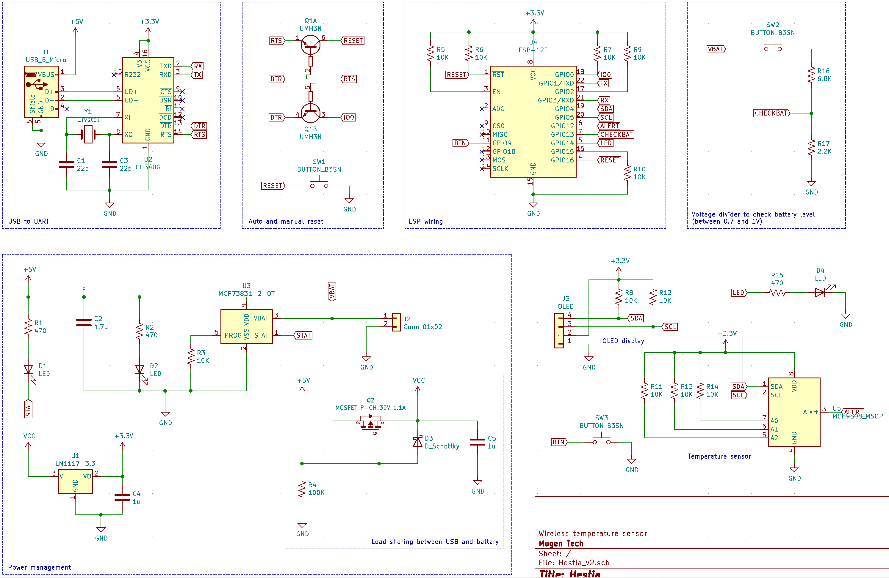
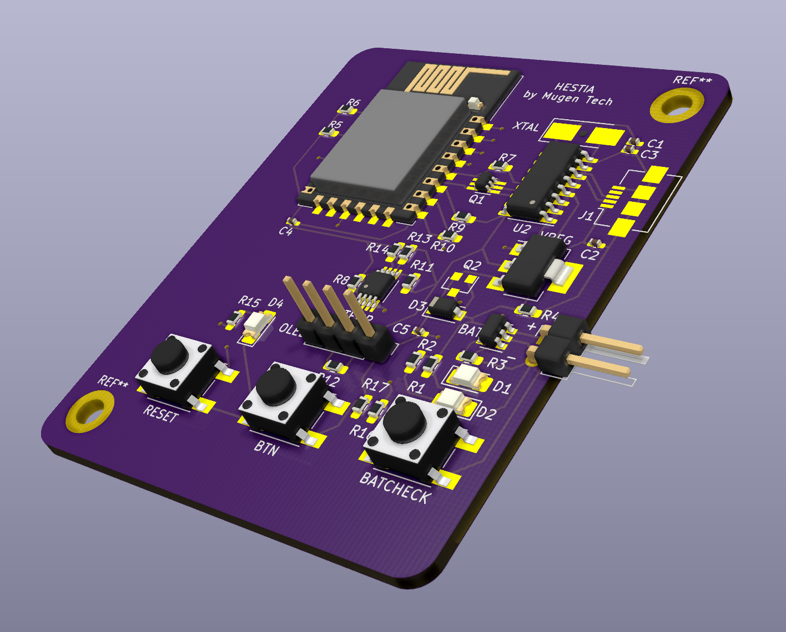

# Hestia
A battery powered WiFi temperature sensor. The name comes from the ancient greek goddess of the hearth.

Because of its rather simple function (showing the temperature), this board can also serve as a base for other IOT projects. It embeds many basic features:
- USB to UART (CH340G)
- Auto-reset for code upload
- Li-Ion battery management (MCP73831)
- Battery level indicator
- Load sharing between battery and USB
- ESP8266 minimal wiring

The schematic should be easily customizable for other projects.

## Temperature sensor
This project uses the MCP9808 chip to measure the temperature. The reason for choosing this IC is because it uses I2C and will provide a more accurate reading than the MCU's ADC.

## Display
The board features 4 holes to wire a 0.91 inch OLED display. 

## Casing
The casing can be 3D printed.
